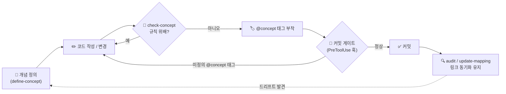

# Conceptpowers

> **코드를 바꾸기 전에, 개념을 먼저 정의하라.** Claude Code를 위한 개념 주도 개발(Concept-Driven Development, CDD) 거버넌스 — 정의한 개념이 기계가 검증 가능한 규칙이 되어, 모든 편집과 커밋에서 강제된다.

*다른 언어로 보기: [English](README.md).*

---

## 왜 Conceptpowers인가?

### 문제 — 의도는 코드보다 빨리 썩는다

코드베이스에서 가장 값지면서 가장 복구하기 어려운 자산은 **의도(intent)**다 — 그것이 *왜* 그렇게 동작하는가("관리자는 하드 삭제되지 않는다", "결제 완료 후 가격은 불변이다"). 이 의도는 누군가의 머릿속, 낡은 위키, 혹은 그 어디에도 없다. 코드가 커질수록 — 특히 AI 에이전트가 빠르게 더 많은 코드를 쓸수록 — 코드는 표현해야 할 개념에서 조용히 멀어지고, 아무도 적어두지 않은 규칙이 아무도 모르게 위반된다. 그 대가는 버그 하나가 아니라, 누적되는 아키텍처 드리프트와 이미 내린 결정의 재논의, 그리고 "왜"가 어디에도 없어 늘어지는 온보딩이다.

기존 도구로는 해결되지 않는다. 어느 것도 *의도를 강제*하지 않기 때문이다:

- 📄 **문서·위키**는 설명할 뿐 강제하지 않는다. 다음 커밋이면 낡는다.
- ✅ **테스트**는 동작을 담을 뿐 그 *이유*를 담지 않는다 — 테스트가 통과해도 규칙이 지켜졌다는 뜻은 아니다.
- 💬 **코드 리뷰**는 사람이 적절한 순간에 적히지 않은 규칙을 기억할 때만 위반을 잡는다.
- 🤖 **AI 에이전트**는 "지금 동작하게"에 최적화하며, 제약이 *왜* 존재하는지에 대한 지속적 기억이 없다.

### 의도 — 개념은 코드보다 먼저 오는 계약이다

Conceptpowers는 **개념을 코드 위에 있는 1급의, 버전 관리되는 계약**으로 다룬다. 세 가지 원칙:

1. **코드보다 개념 먼저.** 목적, 허용/제한 동작, 불변 규칙을 구조화된 데이터로 *먼저* 정의한다. 코드는 그 하위이며 개념을 따라야 한다.
2. **계약의 주인은 사람 — 사람이 직접 작성함으로써.** 에이전트는 개념을 *초안*으로 남길 수 있다 — 사용자가 작성한 초안은 🟡 pending으로 시작하고, 일관성 검사를 통과하면 🟢 green이 된다. 사람 없이 에이전트가 *유추*한 개념은 🔴 red로 시작하며, 오직 사람만 승급시킬 수 있다. 에이전트는 사람이 작성하지 않은 개념을 결코 확정하지 않는다.
3. **막는 벽이 아니라 안내하는 가드레일.** 게이트는 미정의 개념·미승인 개념·개념↔코드 드리프트를 편집/커밋 바로 그 순간에 드러내고 결정을 묻는다 — 조용히 거부하지도, 조용히 통과시키지도 않으며, 강행(override)은 기록으로 남는다.

### 얻는 이점

- 🧠 **의도가 살아남는다.** "왜"가 부족 지식이 아니라 기계가 검증하는 계약이 된다.
- 🤖 **AI가 레일 위에 머문다.** 에이전트는 코드를 쓰기 *전에* 개념을 검증하고, 규칙을 조용히 위반할 수 없다.
- 🚨 **드리프트를 일찍 잡는다.** 개념의 계약이 바뀌었는데 같은 커밋에서 코드가 아직 따라오지 못하면 커밋 게이트가 — 바뀐 *이유*까지 함께 — 알려준다. 둘이 소리 없이 갈라지게 두지 않는다.
- 🔍 **리뷰가 가벼워진다.** 적히지 않던 규칙이 이제 적혀 강제되므로, 리뷰는 규칙 암기가 아니라 판단에 시간을 쓴다.
- 🗺️ **온보딩이 빨라진다.** 탐색 가능한 개념 뷰어와 개념·기능·코드 지식 그래프가 각 부분이 *무엇을 의미*하고 어떻게 연결되는지 보여준다.
- 🔓 **opt-in, 종속 없음.** 마커 파일 하나로 프로젝트별로 켠다. 마커가 없으면 훅도 없다. JSON + git만으로 동작하며, 앱에 런타임 의존성을 더하지 않는다.

"왜"는 더 이상 부족 지식이 아니라 강제되는 계약이 된다.

---

## 빠른 시작 (Quick Start)

Claude Code 안에서 세 줄이면 시작된다:

```bash
/plugin marketplace add hinyc/Conceptpowers   # 1. 마켓플레이스 추가
/plugin install conceptpowers@conceptpowers-dev # 2. 플러그인 설치
/conceptpowers:init                             # 3. 프로젝트에 활성화
```

`/conceptpowers:init`은 `docs/conceptpowers/`를 스캐폴딩하고 `init.json` 마커를 생성한다. 이 마커가 스위치다 — 존재하는 순간 거버넌스 훅이 해당 프로젝트에서 자동으로 활성화된다.

### 최신 버전 유지

Conceptpowers는 서드파티 마켓플레이스에서 배포되며, **자동 업데이트는 기본 OFF**다. 항상 최신 버전을 쓰려면 한 번만 켜두면 된다:

> `/plugin marketplace` → **Marketplaces** 탭 → `conceptpowers-dev` 선택 → **auto-update** 활성화.

그러면 Claude Code가 시작 시 플러그인을 갱신하고, 새 버전이 도착하면 `/reload-plugins`를 안내한다. 수동으로 업데이트하려면:

```bash
/plugin marketplace update conceptpowers-dev    # 마켓플레이스 메타데이터 갱신
/plugin update conceptpowers@conceptpowers-dev  # 플러그인 업데이트
```

> **메인테이너:** 사용자에게 업데이트가 반영되려면 `version` 문자열을 올려야 한다 — 커밋만 푸시해서는 반영되지 않는다. `pnpm release <patch|minor|major|x.y.z>`로 릴리스하면 `plugin.json` / `marketplace.json` / `package.json` 버전을 동기화하고 **`dist/`를 재빌드**한 뒤(훅이 `dist/*.js`를 직접 실행하므로, 재빌드 없는 릴리스는 낡은 훅을 배포한다) 커밋·태그까지 만든다. `git push --follow-tags`로 푸시한다.

### 새 버전 알림 (version check)

conceptpowers가 활성화된 프로젝트는 세션 시작 시 GitHub의 최신 플러그인 버전을 확인하고,
더 높은 버전이 있으면 한 줄로 알립니다(업데이트는 수동: `/plugin marketplace update conceptpowers-dev`).
조회는 24h 캐시·짧은 타임아웃의 best-effort이며 실패해도 세션에 영향이 없습니다.

끄려면 `docs/conceptpowers/init.json`에 `"versionCheck": false`를 두거나,
환경변수 `CONCEPTPOWERS_NO_VERSION_CHECK=1`을 설정하세요.

---

## 동작 방식 (How it Works)

> **Conceptpowers는 LLM이 루프 안에 있을 때만 동작한다.** 지능은 에이전트에 있지 엔진에 있지 않다. 함께 배포되는 엔진(`src/`)은 순수하게 결정론적이다 — 개념 스키마를 검증하고, `@concept` ↔ 코드 매핑 캐시를 관리하고, 상태(status)와 정렬(alignment) 상태를 추적하고, JSON을 읽고 쓴다. 정작 모든 *판단* — "이 변경이 개념의 allow/restrict/immutable 규칙을 위배하는가?", "이 두 개념이 충돌하는가?", "개념이 없는 기능은 무엇인가?" — 은 Claude가 스킬을 읽고 수행한다. 자연어로 쓰인 의도를 실제 코드와 대조해 추론해야 하는 일이기 때문이다. LLM이 없으면 Conceptpowers는 구조화된 파일 관리 도구로 전락한다: 게이트는 여전히 발동하지만, 어떤 변경이 실제로 위반인지 판단할 주체가 없다. 엔진은 스스로 LLM을 호출하지 않는다 — 추론은 스킬이 실행되는 Claude Code 대화 안에서 일어난다.

Conceptpowers는 단순한 루프로 개념과 코드를 같은 보조에 묶어둔다:



1. **정의(Define)**: 개념을 구조화된 데이터로 정의한다 (`/conceptpowers:define-concept`). 목적, 허용/제한 동작, 불변 규칙을 담는다.
2. **검증(Check)**: 코드 변경 전 검증한다 (`/conceptpowers:check-concept`). 에이전트가 관련 개념을 찾아 변경이 그것을 위배하는지 판단한다.
3. **강제(Enforce)**: 세 개의 훅 접점에서 자동으로 강제된다. **SessionStart** 훅이 활성 개념(및 드리프트)을 컨텍스트에 로드하고, **PreToolUse** 훅은 미정의 `@concept`·미승인(red) 개념·개념↔코드 드리프트를 참조하는 커밋 직전에 멈춰 수정 또는 확인을 묻는다 — 강행해도 조용히 사라지지 않고 기록으로 남는다. 커밋이 완료되면 **PostToolUse** 훅이 코드가 함께 올라간 개념들을 재정렬해 드리프트 신호를 스스로 해소한다.
4. **감사(Audit)**: 언제든 (`/conceptpowers:audit`) 개념 없는 코드를 찾고 모든 `@concept` 링크가 여전히 유효한지 확인한다.

모든 강제는 **프로젝트별 opt-in**이며, 전적으로 `docs/conceptpowers/init.json` 마커에 의해 게이트된다 — 마커가 없으면 훅도 없다.

### 개념 상태(status)와 승인

모든 개념은 **상태(status)**를 가져, 사람이 실제로 확정한 것이 무엇인지 항상 드러난다:

- 🟢 **green** — 검증된 source of truth (사용자 작성 + 일관성 검증).
- 🟡 **pending** — `define-concept`로 사용자가 작성, 정착 전. 일관성 통과 시 자동 green, 충돌 남으면 pending 유지.
- 🔴 **red** — 자동 추론(작성자 없음) 또는 거부. 사람만 green으로 승급.

뷰어는 개념마다 배지를 표시하고, 스테이징된 변경이 red 개념을 건드리면 커밋 게이트가 **강조된 경고**를 띄운다 — 조용히 하드 차단하지 않고 "그래도 커밋할까요?"를 묻는다.

에이전트는 일관성 검사를 통과한 뒤에만 **사용자가 작성한 pending을 green으로 승급**할 수 있다. 확정된 green/red는 절대 변경하지 않는다. 사람의 제어 지점은 개념의 내용을 **직접 작성**하는 것이며, 별도의 승인 토글이 아니다. 엔진이 전이 가드로 이를 뒷받침한다 — `setConceptStatus` / `approve`가 불법 상태 전이를 거부한다(green·red는 *settled*이라 이 경로로는 강등 불가, `approve`는 red 개념에만 작동). 단, 승급 전 일관성 검사가 실제로 통과했는지는 기계가 검증할 수 없으며 여전히 에이전트의 판단이다.

green 개념이 다른 개념과 충돌할 때: **green이 우선**하고 red가 양보(수정/재플래그)하며, **green ↔ green** 충돌은 중단하고 사용자에게 올린다.

### 커밋 시점에 일어나는 일

`git commit`은 두 개의 훅으로 감싸이고, 그 사이에 검증 스킬이 실행되어 있어야 한다. 거버넌스가 실제로 물리는 지점이 바로 여기다.

**커밋 직전 — `PreToolUse` 게이트**가 스테이징된 파일을 검사해 정확히 하나의 결정을 돌려준다:

| 스테이징된 변경의 조건 | 결정 | 보이는 메시지 |
| --- | --- | --- |
| `@concept:` 태그가 **존재하지 않는** 개념을 가리킴 | **ask** | `[WARNING] undefined concept tag …` — 개념을 정의하거나 태그를 고치거나, 그래도 커밋 |
| 개념이 코드 정렬 이후 **바뀌었는데**, 그 관련 코드가 **이번 커밋에 없음**(드리프트) | **ask** | `[CONCEPT DRIFT] …` — 기록된 *변경 이유*와 함께. 코드를 함께 스테이징하거나, 강행(`[Drift Ignored]`로 기록) |
| 스테이징된 변경이 아직 🔴 **미승인** 개념을 건드림 | **ask** | `[WARNING] UNAPPROVED CONCEPTS …` — 검토/승인하거나, 그래도 커밋 |
| 위 어느 것도 아님 | **allow** | 진행. 단 게이트는 check-concept / check-consistency를 실행했어야 함을 다시 상기시킨다 |

게이트는 **절대 하드 차단하지 않는다** — 모든 문제는 *ask*(차단 **+** 강행)다. 한쪽으로 강제된 운전대일 뿐 벽이 아니다 — "아니, 그래도 커밋해"라고 하면 양보하고, 그 강행은 조용히 사라지지 않고 기록된다.

**그 사이 — 에이전트가 게이트를 통과시키려 실행하는 스킬:**
- `check-concept` — 스테이징된 *코드*가 관련 개념을 지키는지 검증한다 (코드 ↔ 개념).
- `check-consistency` — *바뀐 개념*이 다른 개념과 충돌하지 않는지 검증한다 (개념 ↔ 개념).
- `update-mapping` — `@concept` 태그와 캐시를 재동기화해 게이트가 최신 링크를 평가하게 한다.

**커밋이 완료된 뒤 — `PostToolUse` 재정렬(reconcile)**은 커밋이 실제로 일어났는지(HEAD가 전진했고 머지가 아닌지) 확인한 뒤, 그 커밋에 관련 코드가 함께 올라간 모든 개념을 **재정렬**한다: 정렬 락이 새 계약 해시로 전진하고(드리프트 해소), why-log(`history.json`)에 각 개념을 *aligned*로 — 게이트를 강행했다면 *drift-ignored*로 — 기록한다. 이 자가 해소 단계가 드리프트 신호를 영원히 보채지 않고 정직하게 유지한다.

### 프로젝트 전체 스캔 (중도 도입)

이미 진행 중인 프로젝트에 Conceptpowers를 도입한다면? `init` **strict** 모드가 *전체 스캔*을 수행한다 — 모든 버튼/동작을 훑고 **화면에 보이는 내용까지 분석**해 기능을 나열한 뒤, 개념이 없는 기능마다 (red) 개념을 유추한다. 철저하지만 **대형 프로젝트에서는 시간·토큰 소모가 크다** — init 스킬이 실행 전에 경고하며, 기본값은 점진적(incremental) 백필이다.

### 스킬

각 스킬은 루프의 특정 순간에 켜진다. 가운데 열이 트리거 — *언제* 당신(또는 당신을 대신한 에이전트)이 그 스킬에 손을 대는가다.

| 스킬 | 언제 사용되나 | 무엇을 만들어내나 |
| --- | --- | --- |
| `conceptpowers:init` | **프로젝트당 한 번**, 거버넌스를 켤 때. `strict` 모드는 기존 코드베이스를 전체 스캔해 개념을 백필한다. | `docs/conceptpowers/` 스캐폴드 + `init.json` 마커(생기는 순간 훅이 살아난다). |
| `conceptpowers:define-concept` | 기존 개념이 **없는** 기능·역할·권한·용어를 추가하기 **전에**. | 🟡 pending으로 탄생하는 새 개념 JSON. 일관성 검사 통과 시 🟢 green이 되고, 그렇지 않으면 충돌 이유를 `note-conflict`로 기록한 채 pending 유지. (자동 유추 개념은 🔴 red.) |
| `conceptpowers:check-concept` | 기능을 추가하거나 동작을 바꾸는 코드(테스트 포함)를 작성/변경하기 **전에**. | 판정 결과: 변경이 관련 개념의 allow / restrict / immutable 규칙을 위배하는가? (코드 ↔ 개념) |
| `conceptpowers:check-consistency` | **개념을 정의·변경할 때마다**, 그리고 **커밋 게이트에서** 다시. | *모든* 개념에 대한 충돌 리포트 — green이 red를 이기고, green↔green은 사용자에게 올린다. 충돌 0일 때만 통과. (개념 ↔ 개념) |
| `conceptpowers:approve` | 사용자가 🔴 개념을 **명시적으로 확정**할 때. | 자동 유추된 🔴 red 개념을 일관성 검사 *뒤* 🟢 green으로 승급하고 뷰어를 다시 렌더링한다. 에이전트가 임의로 승인하지 않는다. |
| `conceptpowers:update-mapping` | **코드 편집 후** `@concept` 링크를 갱신할 때 — 혹은 언제든 재동기화. | 갱신된 `@concept` 태그(진실의 원천) + 재빌드된 `.cache/mapping.json`. |
| `conceptpowers:audit` | **언제든**, 프로젝트 전수 점검용. | 개념 없는 gap 목록, 깨진 `@concept` 링크, 미승인 🔴 개념 — 각각 권장 조치와 함께. |
| `conceptpowers:update-baseline` | 사용자가 baseline 수정을 **명시적으로 요청할 때만**. | 요청된 baseline 수정. 개념의 계약이 바뀌면 `note-change`로 이유를 기록한다. |

### 프로젝트 구조

`/conceptpowers:init` 실행 시 생성되는 구조:

```
docs/conceptpowers/
├── init.json                       # 활성화 마커
├── features/                       # 기능 명세
├── concepts/
│   ├── data/<group>/<slug>.json    # 개념 데이터
│   ├── viewer/index.html           # 탐색 가능한 개념 뷰어
│   └── .alignment/                 # 드리프트 상태: 락 + why-log — 첫 커밋 재정렬 시 생성 (플러그인 관리, 수정 금지)
├── architecture/architecture.md    # 아키텍처 템플릿
├── infra/infra.md                  # 인프라 템플릿
└── .cache/mapping.json             # 자동 매핑 캐시 — 첫 update-mapping 시 생성 (수정 금지)
```

baseline(개념·명세·아키텍처·인프라) 전체는 **사용자 전속** 수정이다 — 에이전트가 임의로 다시 쓰지 않는다.

자세한 설계: `docs/specs/2026-06-18-conceptpowers-design.md`.

### superpowers와 함께 쓰기

Conceptpowers는 [superpowers](https://github.com/obra/superpowers)와 충돌 없이 보완한다. superpowers가 개발 *프로세스*(아이디어 → 스펙 → 계획 → TDD)를 이끌고, Conceptpowers가 개념 정의/검증 *게이트*를 더한다. 자세한 흐름: `docs/superpowers-interop.md`.

---

## 라이선스 & 커뮤니티

- **라이선스:** MIT — [`LICENSE`](LICENSE) 참조.
- **이슈 & 아이디어:** [GitHub Issue](../../issues)를 열어주세요 — 버그 리포트, 개념 스키마 제안, CDD 워크플로우 아이디어 모두 환영합니다.
- **기여:** PR을 환영합니다. 엔진은 `src/`(TypeScript, ESM)에 있으며, 제출 전 `pnpm build`와 `pnpm test`(커버리지 80%+)를 실행해 주세요.
- **English:** 영문 가이드는 [README.md](README.md)를 참조하세요.

Conceptpowers가 의도와 코드를 일치시키는 데 도움이 되었다면, 레포지토리에 ⭐를 눌러 다른 사람들도 찾을 수 있게 해주세요.
