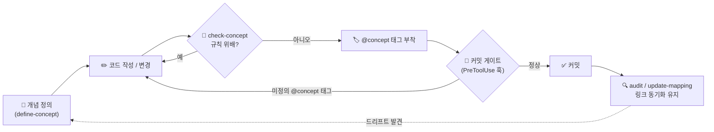

# Conceptpowers

> **코드를 바꾸기 전에, 개념을 먼저 정의하라.** Claude Code를 위한 개념 주도 개발(Concept-Driven Development, CDD) 거버넌스 — 정의한 개념이 기계가 검증 가능한 규칙이 되어, 모든 편집과 커밋에서 강제된다.

*다른 언어로 보기: [English](README.md).*

---

## 왜 Conceptpowers인가?

코드베이스가 커질수록 그 뒤에 있던 **의도**가 사라진다. 규칙("관리자는 절대 삭제될 수 없다", "결제 완료 후 가격은 불변이다")은 누군가의 머릿속이나 낡은 위키, 혹은 그 어디에도 남지 않는다. 코드는 조용히 원래의 개념에서 벗어나고 — 빠르게 움직이는 AI 코딩 에이전트는 아무도 적어두지 않은 규칙을 소리 없이 위반한다.

기존 방식으로는 해결되지 않는다:

- 📄 **문서와 위키**는 코드가 바뀌는 순간 낡는다. 강제하는 장치가 없다.
- 💬 **코드 리뷰**는 사람이 규칙을 기억할 때만 위반을 잡아낸다.
- 🤖 **AI 에이전트**는 코드가 *왜* 이렇게 되어 있는지에 대한 지속적 기억이 없다.

**개념 주도 개발(CDD)**은 이를 뒤집는다. 개념을 *먼저* 정의한다 — 목적, 허용(allow)하는 것, 제한(restrict)하는 것, 불변(immutable)인 것을 구조화된 버전 데이터로. 그 이후 Conceptpowers는:

- ✅ 코드를 작성하기 **전에** 변경안을 개념과 대조해 검증하고,
- 🔒 정의되지 않은 개념을 참조하는 **커밋을 차단**하고,
- 🔍 개념에서 벗어난 코드를 찾아 프로젝트 전체를 **감사(audit)**한다.

"왜"는 더 이상 부족 지식이 아니라 강제되는 계약이 된다.

---

## 빠른 시작 (Quick Start)

Claude Code 안에서 세 줄이면 시작된다:

```bash
/plugin marketplace add hinyc/Conceptpowers   # 1. 마켓플레이스 추가
/plugin install conceptpowers@conceptpowers-dev # 2. 플러그인 설치
/conceptpowers-init                             # 3. 프로젝트에 활성화
```

`/conceptpowers-init`은 `docs/conceptpowers/`를 스캐폴딩하고 `init.json` 마커를 생성한다. 이 마커가 스위치다 — 존재하는 순간 거버넌스 훅이 해당 프로젝트에서 자동으로 활성화된다.

---

## 동작 방식 (How it Works)

Conceptpowers는 단순한 루프로 개념과 코드를 같은 보조에 묶어둔다:



1. **정의(Define)**: 개념을 구조화된 데이터로 정의한다 (`/conceptpowers-define-concept`). 목적, 허용/제한 동작, 불변 규칙을 담는다.
2. **검증(Check)**: 코드 변경 전 검증한다 (`/conceptpowers-check-concept`). 에이전트가 관련 개념을 찾아 변경이 그것을 위배하는지 판단한다.
3. **강제(Enforce)**: 자동으로 강제된다. SessionStart 훅이 활성 개념을 컨텍스트에 로드하고, PreToolUse 훅이 미정의 `@concept`을 참조하는 커밋을 차단한다.
4. **감사(Audit)**: 언제든 (`/conceptpowers-audit`) 개념 없는 코드를 찾고 모든 `@concept` 링크가 여전히 유효한지 확인한다.

모든 강제는 **프로젝트별 opt-in**이며, 전적으로 `docs/conceptpowers/init.json` 마커에 의해 게이트된다 — 마커가 없으면 훅도 없다.

### 개념 상태(status)와 승인

모든 개념은 **상태(status)**를 가져, 사람이 실제로 확정한 것이 무엇인지 항상 드러난다:

- 🟢 **green** — 사용자 승인됨. 진실의 원천(source of truth).
- 🔴 **red** — 미승인. 자동 유추된 개념(과 충돌하는 개념)은 *제안* 상태로 여기서 시작한다.

뷰어는 개념마다 배지를 표시하고, 스테이징된 변경이 red 개념을 건드리면 커밋 게이트가 **강조된 경고**를 띄운다 — 조용히 하드 차단하지 않고 "그래도 커밋할까요?"를 묻는다.

개념이 green이 되는 방식은 `init.json`의 `approvalMode`로 제어한다:

- **manual** (기본) — 에이전트는 status를 **절대** 바꾸지 않는다. 사용자가 개념 JSON의 `status`를 직접 `green`으로 수정해 승인한다. 자동 승인은 설계상 차단되어, 최종 개념 집합은 항상 사용자의 것이다.
- **cli** — 일관성 검사를 통과한 *뒤* `conceptpowers-approve` 스킬(또는 `approve <slug>`)이 개념을 green으로 전환할 수 있다.

green 개념이 다른 개념과 충돌할 때: **green이 우선**하고 red가 양보(수정/재플래그)하며, **green ↔ green** 충돌은 중단하고 사용자에게 올린다.

### 프로젝트 전체 스캔 (중도 도입)

이미 진행 중인 프로젝트에 Conceptpowers를 도입한다면? `init` **strict** 모드가 *전체 스캔*을 수행한다 — 모든 버튼/동작을 훑고 **화면에 보이는 내용까지 분석**해 기능을 나열한 뒤, 개념이 없는 기능마다 (red) 개념을 유추한다. 철저하지만 **대형 프로젝트에서는 시간·토큰 소모가 크다** — init 스킬이 실행 전에 경고하며, 기본값은 점진적(incremental) 백필이다.

### 스킬

| 스킬 | 설명 |
| --- | --- |
| `conceptpowers-init` | 거버넌스 활성화, `docs/conceptpowers`와 마커 스캐폴딩 |
| `conceptpowers-define-concept` | 새 기능·역할·권한·용어에 대한 구조화된 개념 정의 |
| `conceptpowers-check-concept` | 코드 변경 전 관련 개념을 찾아 allow/restrict/immutable 규칙 위배 판단 |
| `conceptpowers-check-consistency` | 신규/변경 개념을 기존 개념과 비교해 충돌 탐지 (커밋 게이트) |
| `conceptpowers-update-mapping` | `@concept` 태그와 매핑 캐시 동기화 |
| `conceptpowers-audit` | 개념 누락 코드(gap)와 `@concept` 링크 무결성 전체 점검 |
| `conceptpowers-update-baseline` | 사용자가 명시적으로 요청할 때만 baseline 수정 |

### 프로젝트 구조

`/conceptpowers-init` 실행 시 생성되는 구조:

```
docs/conceptpowers/
├── init.json                       # 활성화 마커
├── features/                       # 기능 명세
├── concepts/
│   ├── data/<group>/<slug>.json    # 개념 데이터
│   └── viewer/index.html           # 탐색 가능한 개념 뷰어
├── architecture/architecture.md    # 아키텍처 템플릿
├── infra/infra.md                  # 인프라 템플릿
└── .cache/mapping.json             # 자동 매핑 캐시 (수정 금지)
```

baseline(개념·명세·아키텍처·인프라) 전체는 **사용자 전속** 수정이다 — 에이전트가 임의로 다시 쓰지 않는다.

자세한 설계: `docs/specs/2026-06-18-conceptpowers-design.md`.

### superpowers와 함께 쓰기

Conceptpowers는 [superpowers](https://github.com/obra/superpowers)와 충돌 없이 보완한다. superpowers가 개발 *프로세스*(아이디어 → 스펙 → 계획 → TDD)를 이끌고, Conceptpowers가 개념 정의/검증 *게이트*를 더한다. 자세한 흐름: `docs/superpowers-interop.md`.

---

## 라이선스 & 커뮤니티

- **라이선스:** MIT — [`LICENSE`](LICENSE) 참조.
- **이슈 & 아이디어:** [GitHub Issue](../../issues)를 열어주세요 — 버그 리포트, 개념 스키마 제안, CDD 워크플로우 아이디어 모두 환영합니다.
- **기여:** PR을 환영합니다. 엔진은 `src/`(TypeScript, ESM)에 있으며, 제출 전 `pnpm build`와 `pnpm test`(커버리지 80%+)를 실행해 주세요.
- **English:** 영문 가이드는 [README.md](README.md)를 참조하세요.

Conceptpowers가 의도와 코드를 일치시키는 데 도움이 되었다면, 레포지토리에 ⭐를 눌러 다른 사람들도 찾을 수 있게 해주세요.
