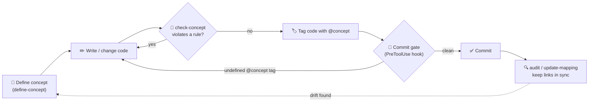

# Conceptpowers

> **Define the concept before you change the code.** Concept-Driven Development (CDD) governance for Claude Code — your concepts become machine-checkable rules that are enforced on every edit and commit.

*Read this in [한국어](README.ko.md).*

---

## Why Conceptpowers?

### The problem — intent decays faster than code

A codebase's most valuable, least recoverable asset is **intent**: the reasons it works the way it does ("admins are never hard-deleted", "prices are immutable after checkout"). That intent lives in someone's head, a stale wiki, or nowhere. As the code grows — and especially as AI agents write more of it, fast — code silently drifts from the concept it was meant to express, and rules no one wrote down get violated with no one noticing. The cost isn't one bug; it's compounding architectural drift, re-litigated decisions, and onboarding that drags because the "why" lives nowhere.

None of the usual tools fix this, because none of them *enforce intent*:

- 📄 **Docs & wikis** describe; they don't enforce. They're stale on the next commit.
- ✅ **Tests** encode behavior, not the *why* behind it — a green test doesn't mean the rule was respected.
- 💬 **Code review** only catches a violation if a human happens to remember an unwritten rule at the right moment.
- 🤖 **AI agents** optimize for "make it work now," with no durable memory of why a constraint exists.

### The intent — a concept is a contract that comes before the code

Conceptpowers treats a **concept as a first-class, versioned contract** that sits *above* the code. Three principles:

1. **Concept before code.** Define purpose, allowed/restricted actions, and immutable rules as structured data *first*; code is downstream and must conform.
2. **The human owns the contract.** The agent may *propose* concepts (status 🔴 red); only a person *approves* them (🟢 green). Auto-approval is blocked by design — the source of truth is always what a human confirmed.
3. **Guardrails that navigate, not walls that block.** Gates surface undefined concepts, unapproved concepts, and concept↔code drift at the exact moment of edit/commit, then ask you to decide — they neither silently reject nor silently wave changes through, and any override is recorded.

### What you gain

- 🧠 **Intent survives.** The "why" becomes a machine-checkable contract instead of tribal knowledge.
- 🤖 **AI stays on-rails.** Agents check the concept *before* writing code and can't quietly violate a rule.
- 🚨 **Drift is caught early.** When a concept changes but its code lags behind (or vice versa), the commit gate flags it — with the recorded *reason* it changed — instead of letting them diverge in silence.
- 🔍 **Lighter reviews.** The unwritten rule is now written and enforced, so review spends its time on judgment, not rule-recall.
- 🗺️ **Faster onboarding.** A browsable concept viewer and a concept·feature·code knowledge graph show what each part *means* and how it all connects.
- 🔓 **Opt-in, no lock-in.** One marker file switches it on per project; no marker, no hooks. Just JSON + git, with zero runtime dependency added to your app.

The "why" stops being tribal knowledge and becomes an enforced contract.

---

## Quick Start

Inside Claude Code, three commands get you running:

```bash
/plugin marketplace add hinyc/Conceptpowers   # 1. add the marketplace
/plugin install conceptpowers@conceptpowers-dev # 2. install the plugin
/conceptpowers-init                             # 3. enable it in your project
```

`/conceptpowers-init` scaffolds `docs/conceptpowers/` and drops an `init.json` marker. That marker is the switch: once it exists, the governance hooks activate automatically for the project.

---

## How it Works

Conceptpowers keeps concepts and code in lockstep through a simple loop:



1. **Define** a concept as structured data (`/conceptpowers-define-concept`). It captures purpose, allowed/restricted actions, and immutable rules.
2. **Check** before changing code (`/conceptpowers-check-concept`). The agent finds the related concept and judges whether the change violates it.
3. **Enforce** automatically across three hook touchpoints. The **SessionStart** hook loads active concepts (and any drift) into context; the **PreToolUse** hook stops before a commit that references an undefined `@concept`, an unapproved (red) concept, or concept↔code drift, and asks you to fix or confirm — overrides are recorded rather than silently lost; the **PostToolUse** hook, after a commit lands, re-aligns the concepts whose code shipped so the drift signal clears itself.
4. **Audit** anytime (`/conceptpowers-audit`) to find concept-less code and verify every `@concept` link still resolves.

All enforcement is **opt-in per project**, gated entirely by the `docs/conceptpowers/init.json` marker — no marker, no hooks.

### Concept status & approval

Every concept carries a **status** so you always know what the human has actually confirmed:

- 🟢 **green** — user-approved. The source of truth.
- 🔴 **red** — unapproved. Auto-inferred concepts (and conflicting ones) start here as *proposals*.

The viewer shows a badge for each concept, and the commit gate surfaces an **emphasized warning** when staged changes touch a red concept — it never silently hard-blocks, but asks "commit anyway?".

How a concept becomes green is controlled by `approvalMode` in `init.json`:

- **manual** (default) — the agent must **never** flip status. You approve by editing `status` to `green` in the concept JSON. Auto-approval is blocked by design, so the final concept set is always yours.
- **cli** — the `conceptpowers-approve` skill (or `approve <slug>`) may flip a concept to green *after* a consistency check.

When a green concept conflicts with others: **green wins** over red (the red one is revised/re-flagged), and a **green ↔ green** conflict stops and is escalated to you.

### What happens at commit time

A `git commit` is bracketed by two hooks, with the verification skills expected to have run in between. This is where the governance actually bites.

**Before the commit — the `PreToolUse` gate** inspects the staged files and returns exactly one decision:

| Condition in the staged changes | Decision | What you see |
| --- | --- | --- |
| An `@concept:` tag points to a concept that **doesn't exist** | **ask** | `[WARNING] undefined concept tag …` — define it or fix the tag, or commit anyway |
| A concept **changed** since its code was last aligned, but that related code is **not in this commit** (drift) | **ask** | `[CONCEPT DRIFT] …` with the recorded *reason it changed* — stage the code too, or override (recorded as `[Drift Ignored]`) |
| The staged changes touch a still-🔴 **unapproved** concept | **ask** | `[WARNING] UNAPPROVED CONCEPTS …` — review/approve, or commit anyway |
| None of the above | **allow** | proceeds; the gate still reminds the agent it should have run check-concept / check-consistency |

The gate **never hard-blocks** — every problem is an *ask* (block **with** override). It's a steering wheel forced one way, not a wall: if you say "no, commit anyway," it yields, and the override is recorded rather than silently lost.

**In between — the skills the agent runs to clear the gate:**
- `check-concept` verifies the staged *code* obeys its related concepts (code ↔ concept).
- `check-consistency` verifies any *changed concept* doesn't conflict with the others (concept ↔ concept).
- `update-mapping` resyncs the `@concept` tags and cache so the gate evaluates current links.

**After the commit lands — the `PostToolUse` reconcile** confirms the commit actually happened (HEAD advanced, and it isn't a merge), then **re-aligns** every concept whose related code shipped in that commit: its alignment lock advances to the new contract hash (so drift clears), and the why-log (`history.json`) records each concept as *aligned* — or, if you overrode the gate, as *drift-ignored*. This self-clearing step is what keeps the drift signal honest instead of nagging forever.

### Full project scan (mid-project adoption)

Adopting Conceptpowers on an existing project? `init` **strict** mode runs a *full scan*: it enumerates features by walking every button/action **and** analyzing on-screen content, then infers a (red) concept for each uncovered feature. This is thorough but **time- and token-intensive on large projects** — the init skill warns you before running it, and incremental backfill remains the default.

### Skills

Each skill activates at a specific moment in the loop. The middle column is the trigger — *when* you (or the agent, on your behalf) reach for it.

| Skill | When it runs | What it produces |
| --- | --- | --- |
| `conceptpowers-init` | **Once per project**, to switch governance on. `strict` mode additionally full-scans an existing codebase to backfill concepts. | The `docs/conceptpowers/` scaffold + the `init.json` marker (hooks go live the moment it exists). |
| `conceptpowers-define-concept` | **Before** adding a feature / role / permission / term that **no** existing concept covers. | A new concept JSON (status 🔴 red) saved after a consistency check. If it *redefines* an existing concept, also records the change reason via `note-change` so drift stays traceable. |
| `conceptpowers-check-concept` | **Before** writing or changing any code (tests included) that adds a feature or alters behavior. | A verdict: does the change violate a related concept's allow / restrict / immutable rules? (code ↔ concept) |
| `conceptpowers-check-consistency` | **Whenever a concept is defined or changed**, and again **at the commit gate**. | A conflict report across *all* concepts — green wins over red, green↔green escalates to you. Passes only at zero conflicts. (concept ↔ concept) |
| `conceptpowers-approve` | When the user **confirms** a 🔴 concept — allowed only in `approvalMode: cli`. | Flips status 🔴 → 🟢 *after* a consistency check, then re-renders the viewer. The agent never approves on its own. |
| `conceptpowers-update-mapping` | **After editing code**, to refresh the `@concept` links — or anytime, to resync. | Updated `@concept` tags (source of truth) + a rebuilt `.cache/mapping.json`. |
| `conceptpowers-audit` | **Anytime**, for a whole-project sweep. | A list of concept-less gaps, broken `@concept` links, and unapproved 🔴 concepts, each with a recommended action. |
| `conceptpowers-update-baseline` | **Only** when the user explicitly asks to edit the baseline. | The requested baseline edit; when a concept's contract changes, records the reason via `note-change`. |

### Project structure

`/conceptpowers-init` creates:

```
docs/conceptpowers/
├── init.json                       # activation marker + settings (locale, approvalMode, backfillMode)
├── features/                       # feature specs
├── concepts/
│   ├── data/<group>/<slug>.json    # concept data
│   ├── viewer/index.html           # browsable concept viewer
│   └── .alignment/                 # drift state: alignment lock + why-log (plugin-managed, do not edit)
├── architecture/architecture.md    # architecture template
├── infra/infra.md                  # infra template
└── .cache/mapping.json             # auto mapping cache (do not edit)
```

The entire baseline (concepts, specs, architecture, infra) is edited **exclusively by the user** — the agent never rewrites it on its own.

Detailed design: `docs/specs/2026-06-18-conceptpowers-design.md`.

### Using with superpowers

Conceptpowers complements [superpowers](https://github.com/obra/superpowers) without conflict. superpowers drives the development *process* (idea → spec → plan → TDD); Conceptpowers adds the concept definition / verification *gates*. Detailed flow: `docs/superpowers-interop.md`.

---

## License & Community

- **License:** MIT — see [`LICENSE`](LICENSE).
- **Issues & ideas:** open a [GitHub Issue](../../issues) — bug reports, concept-schema proposals, and CDD workflow ideas are all welcome.
- **Contributing:** PRs welcome. The engine lives in `src/` (TypeScript, ESM); run `pnpm build` and `pnpm test` (80%+ coverage) before submitting.
- **Korean users:** see [README.ko.md](README.ko.md) for the full Korean guide.

If Conceptpowers helps you keep intent and code in sync, a ⭐ on the repo helps others find it.
