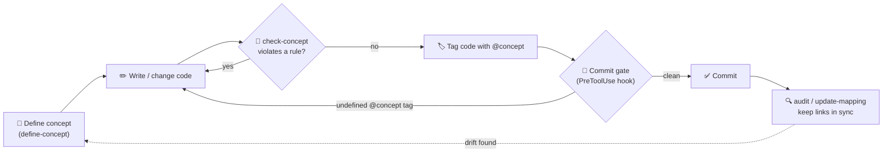

# Conceptpowers

> **Define the concept before you change the code.** Concept-Driven Development (CDD) governance for Claude Code — your concepts become machine-checkable rules that are enforced on every edit and commit.

*Read this in [한국어](README.ko.md).*

---

## Why Conceptpowers?

As a codebase grows, the **intent** behind it gets lost. The rules ("admins can never be deleted", "prices are immutable after checkout") live in someone's head, in a stale wiki, or nowhere at all. Code silently drifts from its original concept — and AI coding agents, moving fast, make changes that quietly violate rules no one wrote down.

Conventional approaches don't solve this:

- 📄 **Docs & wikis** go stale the moment code changes. Nothing enforces them.
- 💬 **Code review** catches violations only if a human happens to remember the rule.
- 🤖 **AI agents** have no durable memory of *why* the code is the way it is.

**Concept-Driven Development** flips this. You define a concept *first* — its purpose, what it allows, what it restricts, what is immutable — as structured, versioned data. From then on, Conceptpowers:

- ✅ checks proposed changes against the concept **before** code is written,
- 🔒 **blocks commits** that reference undefined concepts,
- 🔍 **audits** the whole project for code that drifted away from its concept.

The "why" stops being tribal knowledge and becomes an enforced contract.

---

## Quick Start

Inside Claude Code, three commands get you running:

```bash
/plugin marketplace add hinyc/Conceptpowers   # 1. add the marketplace
/plugin install conceptpowers@conceptpowers-dev # 2. install the plugin
/conceptpowers-init                             # 3. enable it in your project
```

`/conceptpowers-init` scaffolds `docs/conceptpowers/` and drops an `init.json` marker. That marker is the switch: once it exists, the governance hooks activate automatically for the project.

---

## How it Works

Conceptpowers keeps concepts and code in lockstep through a simple loop:



1. **Define** a concept as structured data (`/conceptpowers-define-concept`). It captures purpose, allowed/restricted actions, and immutable rules.
2. **Check** before changing code (`/conceptpowers-check-concept`). The agent finds the related concept and judges whether the change violates it.
3. **Enforce** automatically. The SessionStart hook loads active concepts into context; the PreToolUse hook blocks any commit that references an undefined `@concept`.
4. **Audit** anytime (`/conceptpowers-audit`) to find concept-less code and verify every `@concept` link still resolves.

All enforcement is **opt-in per project**, gated entirely by the `docs/conceptpowers/init.json` marker — no marker, no hooks.

### Concept status & approval

Every concept carries a **status** so you always know what the human has actually confirmed:

- 🟢 **green** — user-approved. The source of truth.
- 🔴 **red** — unapproved. Auto-inferred concepts (and conflicting ones) start here as *proposals*.

The viewer shows a badge for each concept, and the commit gate surfaces an **emphasized warning** when staged changes touch a red concept — it never silently hard-blocks, but asks "commit anyway?".

How a concept becomes green is controlled by `approvalMode` in `init.json`:

- **manual** (default) — the agent must **never** flip status. You approve by editing `status` to `green` in the concept JSON. Auto-approval is blocked by design, so the final concept set is always yours.
- **cli** — the `conceptpowers-approve` skill (or `approve <slug>`) may flip a concept to green *after* a consistency check.

When a green concept conflicts with others: **green wins** over red (the red one is revised/re-flagged), and a **green ↔ green** conflict stops and is escalated to you.

### Full project scan (mid-project adoption)

Adopting Conceptpowers on an existing project? `init` **strict** mode runs a *full scan*: it enumerates features by walking every button/action **and** analyzing on-screen content, then infers a (red) concept for each uncovered feature. This is thorough but **time- and token-intensive on large projects** — the init skill warns you before running it, and incremental backfill remains the default.

### Skills

| Skill | Description |
| --- | --- |
| `conceptpowers-init` | Enable governance, scaffold `docs/conceptpowers` and the marker; strict mode runs a full project scan |
| `conceptpowers-define-concept` | Define a structured concept for a new feature/role/permission/term (sets green/red status) |
| `conceptpowers-check-concept` | Find related concepts and judge allow/restrict/immutable violations before changes |
| `conceptpowers-check-consistency` | Compare new/changed concepts against existing ones (green wins, green↔green escalates); commit gate |
| `conceptpowers-approve` | Approve a concept (red → green); user-gated, allowed only in `approvalMode: cli` |
| `conceptpowers-update-mapping` | Sync `@concept` tags and the mapping cache |
| `conceptpowers-audit` | Audit concept-less code (gaps), `@concept` link integrity, and unapproved (red) concepts |
| `conceptpowers-update-baseline` | Modify the baseline only when the user explicitly asks |

### Project structure

`/conceptpowers-init` creates:

```
docs/conceptpowers/
├── init.json                       # activation marker + settings (locale, approvalMode, backfillMode)
├── features/                       # feature specs
├── concepts/
│   ├── data/<group>/<slug>.json    # concept data
│   └── viewer/index.html           # browsable concept viewer
├── architecture/architecture.md    # architecture template
├── infra/infra.md                  # infra template
└── .cache/mapping.json             # auto mapping cache (do not edit)
```

The entire baseline (concepts, specs, architecture, infra) is edited **exclusively by the user** — the agent never rewrites it on its own.

Detailed design: `docs/specs/2026-06-18-conceptpowers-design.md`.

### Using with superpowers

Conceptpowers complements [superpowers](https://github.com/obra/superpowers) without conflict. superpowers drives the development *process* (idea → spec → plan → TDD); Conceptpowers adds the concept definition / verification *gates*. Detailed flow: `docs/superpowers-interop.md`.

---

## License & Community

- **License:** MIT — see [`LICENSE`](LICENSE).
- **Issues & ideas:** open a [GitHub Issue](../../issues) — bug reports, concept-schema proposals, and CDD workflow ideas are all welcome.
- **Contributing:** PRs welcome. The engine lives in `src/` (TypeScript, ESM); run `pnpm build` and `pnpm test` (80%+ coverage) before submitting.
- **Korean users:** see [README.ko.md](README.ko.md) for the full Korean guide.

If Conceptpowers helps you keep intent and code in sync, a ⭐ on the repo helps others find it.
