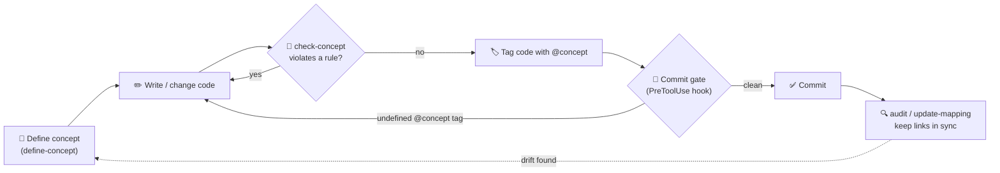

# Conceptpowers

> **Define the concept before you change the code.** Concept-Driven Development (CDD) governance for Claude Code — your concepts become machine-checkable rules that are enforced on every edit and commit.

_Read this in [한국어](README.ko.md)._

---

## Why Conceptpowers?

### The problem — intent decays faster than code

A codebase's most valuable, least recoverable asset is **intent**: the reasons it works the way it does ("admins are never hard-deleted", "prices are immutable after checkout"). That intent lives in someone's head, a stale wiki, or nowhere. As the code grows — and especially as AI agents write more of it, fast — code silently drifts from the concept it was meant to express, and rules no one wrote down get violated with no one noticing. The cost isn't one bug; it's compounding architectural drift, re-litigated decisions, and onboarding that drags because the "why" lives nowhere.

None of the usual tools fix this, because none of them _enforce intent_:

- 📄 **Docs & wikis** describe; they don't enforce. They're stale on the next commit.
- ✅ **Tests** encode behavior, not the _why_ behind it — a green test doesn't mean the rule was respected.
- 💬 **Code review** only catches a violation if a human happens to remember an unwritten rule at the right moment.
- 🤖 **AI agents** optimize for "make it work now," with no durable memory of why a constraint exists.

### The intent — a concept is a contract that comes before the code

Conceptpowers treats a **concept as a first-class, versioned contract** that sits _above_ the code. Three principles:

1. **Concept before code.** Define purpose, allowed/restricted actions, and immutable rules as structured data _first_; code is downstream and must conform.
2. **The human owns the contract by authoring it.** The agent may _draft_ concepts — a user-authored draft starts 🟡 pending and becomes 🟢 green once a consistency check passes; a concept the agent _infers_ without a human starts 🔴 red, and only a person promotes it. The agent never blesses a concept no human authored.
3. **Guardrails that navigate, not walls that block.** Gates surface undefined concepts, unapproved concepts, and concept↔code drift at the exact moment of edit/commit, then ask you to decide — they neither silently reject nor silently wave changes through, and any override is recorded.

### What you gain

- 🧠 **Intent survives.** The "why" becomes a machine-checkable contract instead of tribal knowledge.
- 🤖 **AI stays on-rails.** Agents check the concept _before_ writing code and can't quietly violate a rule.
- 🚨 **Drift is caught early.** When a concept's contract changes but its code hasn't caught up in the same commit, the commit gate flags it — with the recorded _reason_ it changed — instead of letting them diverge in silence.
- 🔍 **Lighter reviews.** The unwritten rule is now written and enforced, so review spends its time on judgment, not rule-recall.
- 🗺️ **Faster onboarding.** A browsable concept viewer and a concept·feature·code knowledge graph show what each part _means_ and how it all connects.
- 🔓 **Opt-in, no lock-in.** One marker file switches it on per project; no marker, no hooks. Just JSON + git, with zero runtime dependency added to your app.

The "why" stops being tribal knowledge and becomes an enforced contract.

---

## Quick Start

Three steps inside Claude Code — run them one at a time.

**1. Add the marketplace**

```bash
/plugin marketplace add hinyc/Conceptpowers
```

This registers the catalog. Nothing is installed yet.

**2. Install the plugin**

```bash
/plugin install conceptpowers@conceptpowers-dev
```

Claude Code then asks for an **installation scope** — that choice decides where the plugin is enabled and who else gets it:

| Scope       | Enabled for                           | Recorded in                                            |
| ----------- | ------------------------------------- | ------------------------------------------------------ |
| **User**    | you, in every project you open        | your user settings (`~/.claude/settings.json`)         |
| **Project** | everyone who works on this repository | the repo's `.claude/settings.json` — committed, shared |
| **Local**   | you, in this repository only          | your local project settings — not shared               |

**Pick User unless you mean to hand this to the whole team.** Conceptpowers is per-project opt-in: it stays dormant until `docs/conceptpowers/init.json` exists, so a user-scope install costs nothing in the projects you never run `init` in. Choose **Project** when the team should share the same governance and get it automatically on clone; choose **Local** to trial it on one repository without touching anyone else's setup.

To skip the picker entirely, install from your shell instead — this form takes the scope as a flag and defaults to user:

```bash
claude plugin install conceptpowers@conceptpowers-dev --scope user
```

**3. Enable it in your project**

```bash
/conceptpowers:init
```

This scaffolds `docs/conceptpowers/` and drops an `init.json` marker. That marker is the switch: once it exists, the governance hooks activate automatically for the project.

### Staying up to date

Conceptpowers ships from a third-party marketplace, where **auto-update is off by default**. To always run the latest version, enable it once:

> `/plugin marketplace` → **Marketplaces** tab → select `conceptpowers-dev` → enable **auto-update**.

Claude Code then refreshes the plugin at startup and prompts `/reload-plugins` when a new version lands. To update manually instead:

```bash
/plugin marketplace update conceptpowers-dev    # refresh marketplace metadata
/plugin update conceptpowers@conceptpowers-dev  # update the plugin
```

> **Maintainers:** updates only reach users when the `version` string is bumped — pushing commits alone is not enough. Cut a release with `pnpm release <patch|minor|major|x.y.z>`, which syncs the version across `plugin.json` / `marketplace.json` / `package.json`, **rebuilds `dist/`** (hooks run `dist/*.js` directly, so a release without a rebuild ships stale hooks), then commits and tags. Push with `git push --follow-tags`.

### Version check notifications

When Conceptpowers is active in a project, it checks GitHub for the latest plugin version at session start.
If a newer version is available, it alerts you in one line (update is manual: `/plugin marketplace update conceptpowers-dev`).
The check uses a 24h cache with a short timeout and is best-effort — even if it fails, your session is unaffected.

To disable version checks, either set `"versionCheck": false` in `docs/conceptpowers/init.json`
or set the environment variable `CONCEPTPOWERS_NO_VERSION_CHECK=1`.
The cache is stored in `~/.cache/conceptpowers` by default; override with `CONCEPTPOWERS_CACHE_DIR`.

---

## How it Works

> **Conceptpowers only works with an LLM in the loop.** The intelligence lives in the agent, not the engine. The bundled engine (`src/`) is purely deterministic — it validates concept schemas, manages the `@concept` ↔ code mapping cache, tracks status and alignment state, and reads/writes JSON. Every act of _judgment_ — "does this change violate a concept's allow/restrict/immutable rules?", "do these two concepts conflict?", "what feature has no concept?" — is performed by Claude reading the skills, because it requires reasoning over natural-language intent against real code. Without an LLM, Conceptpowers degrades to a structured-file manager: the gates still fire, but nothing can decide whether a change is actually a violation. The engine never calls an LLM itself; the reasoning happens inside the Claude Code conversation where the skills run.

Conceptpowers keeps concepts and code in lockstep through a simple loop:


```mermaid
flowchart LR
    A["📐 Define concept<br/>(define-concept)"] --> B["✏️ Write / change code"]
    B --> C{"🔎 check-concept<br/>violates a rule?"}
    C -- "yes" --> B
    C -- "no" --> D["🏷️ Tag code with @concept"]
    D --> E{"🚦 Commit gate<br/>(PreToolUse hook)"}
    E -- "undefined @concept tag" --> B
    E -- "clean" --> F["✅ Commit"]
    F --> G["🔍 audit / update-mapping<br/>keep links in sync"]
    G -. "drift found" .-> A
```

1. **Define** a concept as structured data (`/conceptpowers:define-concept`). It captures purpose, allowed/restricted actions, and immutable rules.
2. **Check** before changing code (`/conceptpowers:check-concept`). The agent finds the related concept and judges whether the change violates it.
3. **Enforce** automatically across three hook touchpoints. The **SessionStart** hook loads active concepts (and any drift) into context; the **PreToolUse** hook stops before a commit that references an undefined `@concept`, an unapproved (red) concept, or concept↔code drift, and asks you to fix or confirm — overrides are recorded rather than silently lost; the **PostToolUse** hook, after a commit lands, re-aligns the concepts whose code shipped so the drift signal clears itself.
4. **Audit** anytime (`/conceptpowers:audit`) to find concept-less code and verify every `@concept` link still resolves.

All enforcement is **opt-in per project**, gated entirely by the `docs/conceptpowers/init.json` marker — no marker, no hooks.

### Concept status & approval

Every concept carries a **status** so you always know what the human has actually confirmed:

- 🟢 **green** — verified source of truth (user-authored + consistency-checked).
- 🟡 **pending** — user-authored via `define-concept`, not yet settled. Becomes green automatically
  once a consistency check passes, or stays pending while a conflict remains.
- 🔴 **red** — auto-inferred (no human author) or rejected. Only a human promotes it (red→green).

The viewer shows a badge for each concept, and the commit gate surfaces an **emphasized warning** when staged changes touch a red concept — it never silently hard-blocks, but asks "commit anyway?".

The agent may only **promote a user-authored pending to green** after a passing consistency check;
it never demotes or changes a settled green/red. The human's control point is **authoring** the
concept's content, not a separate approval toggle. The engine backs this with a transition guard:
`setConceptStatus` / `approve` reject illegal status moves — green and red are _settled_ (no demotion
through this path) and `approve` acts only on a red concept. (Whether the consistency check actually
passed before a promotion remains the agent's judgment — that part is not machine-verifiable.)

Two engine-enforced floors back the promotion: a **quality floor** (a green concept must
carry at least one enforceable rule — or, for a term-only concept, a non-empty example —
each rule ≥10 chars) and a **consistency attestation** (promotion requires a fresh
`check-consistency` result recorded via `attest-consistency`, hash-bound to the concept's
contract so any edit invalidates it). The commit gate likewise asks when a staged concept
change has no fresh attestation. The attestation is the agent's self-report — it can't
prove the check was _thorough_, but it makes skipping the step impossible to hide.

Editing a concept's content (`conceptpowers:update-baseline`) is the one path that touches a settled concept: it's allowed only with the user's explicit approval of the exact change, and it always demotes 🟢 green → 🟡 pending — the concept stops governing code until a fresh `check-consistency` passes (attested) and the user confirms settling it back to 🟢 green — the approve flow is red-only and does not apply here. The agent never hand-edits a concept's JSON to keep it green.

When a green concept conflicts with others: **green wins** over red (the red one is revised/re-flagged), and a **green ↔ green** conflict stops and is escalated to you.

### What happens at commit time

A `git commit` is bracketed by two hooks, with the verification skills expected to have run in between. This is where the governance actually bites.

**Before the commit — the `PreToolUse` gate** inspects the staged files and returns exactly one decision:

| Condition in the staged changes                                                                                | Decision  | What you see                                                                                                                                                                                                                                                        |
| -------------------------------------------------------------------------------------------------------------- | --------- | ------------------------------------------------------------------------------------------------------------------------------------------------------------------------------------------------------------------------------------------------------------------- |
| A hand-written code file carries **no `@concept` marker** at all                                               | **ask**   | `[WARNING] 개념 없는 코드 …` — add `@concept:<slug>`, or an explicit `@concept:none` when no concept applies, or commit anyway. Every governed code file must be marked; only regenerated/external code (`ignoreGlobs`: `dist/**`, `**/*.generated.*`, …) is exempt |
| An `@concept:` tag points to a concept that **doesn't exist**                                                  | **ask**   | `[WARNING] undefined concept tag …` — define it or fix the tag, or commit anyway                                                                                                                                                                                    |
| A concept **changed** since its code was last aligned, but that related code is **not in this commit** (drift) | **ask**   | `[CONCEPT DRIFT] …` with the recorded _reason it changed_ — stage the code too, or override (recorded as `[Drift Ignored]`)                                                                                                                                         |
| The staged changes touch a still-🔴 **unapproved** concept                                                     | **ask**   | `[WARNING] UNAPPROVED CONCEPTS …` — review/approve, or commit anyway                                                                                                                                                                                                |
| None of the above                                                                                              | **allow** | proceeds; the gate still reminds the agent it should have run check-concept / check-consistency                                                                                                                                                                     |

The gate **never hard-blocks** — every problem is an _ask_ (block **with** override). It's a steering wheel forced one way, not a wall: if you say "no, commit anyway," it yields, and the override is recorded rather than silently lost.

**In between — the skills the agent runs to clear the gate:**

- `check-concept` verifies the staged _code_ obeys its related concepts (code ↔ concept).
- `check-consistency` verifies any _changed concept_ doesn't conflict with the others (concept ↔ concept).
- `update-mapping` resyncs the `@concept` tags and cache so the gate evaluates current links.

**After the commit lands — the `PostToolUse` reconcile** confirms the commit actually happened (HEAD advanced, and it isn't a merge), then **re-aligns** every concept whose related code shipped in that commit: its alignment lock advances to the new contract hash (so drift clears), and the why-log (`history.json`) records each concept as _aligned_ — or, if you overrode the gate, as _drift-ignored_. This self-clearing step is what keeps the drift signal honest instead of nagging forever.

### Full project scan (mid-project adoption)

Adopting Conceptpowers on an existing project? `init` **strict** mode runs a _full scan_: it enumerates features by walking every button/action **and** analyzing on-screen content, then infers a (red) concept for each uncovered feature. This is thorough but **time- and token-intensive on large projects** — the init skill warns you before running it, and incremental backfill remains the default.

### init.json settings

`docs/conceptpowers/init.json` is both the activation marker and the per-project settings file.
Missing fields fall back to their defaults, so files created by older versions keep working as-is.
After a plugin update, `/conceptpowers:version-sync` (or the automatic sync that runs at session start and before any Conceptpowers CLI command when artifacts are stale)
**backfills settings introduced by newer versions into the file at their defaults** — values you
already wrote are preserved, so a setting you turned off never flips back on.

| Field                | Allowed values                                                                                                                                                      | Default (when missing)                       | What it does                                                                                                                                                                                                                                                                                                                              |
| -------------------- | ------------------------------------------------------------------------------------------------------------------------------------------------------------------- | -------------------------------------------- | ----------------------------------------------------------------------------------------------------------------------------------------------------------------------------------------------------------------------------------------------------------------------------------------------------------------------------------------- |
| `version`            | any string                                                                                                                                                          | none (**required**)                          | Settings file format version. init writes `"0.1.0"`; you never edit it by hand.                                                                                                                                                                                                                                                           |
| `enabled`            | only `true` (anything else fails validation)                                                                                                                        | none (**required**)                          | The activation marker. There is no `false` — to switch governance off, delete this file (or `docs/conceptpowers/`).                                                                                                                                                                                                                       |
| `backfillMode`       | `"incremental"` \| `"strict"` (anything else fails validation)                                                                                                      | `"incremental"`                              | Adoption mode for existing codebases. `incremental` backfills concepts as you touch code; `strict` full-scans at init and infers red concepts.                                                                                                                                                                                            |
| `enforceScope`       | only `"new-feature-behavior"` (anything else fails validation)                                                                                                      | `"new-feature-behavior"`                     | Enforcement scope. Only new features and behavior changes (tests included) are checked against concepts; plain refactoring, typos, and formatting are out of scope. Currently the single supported value.                                                                                                                                 |
| `locale`             | `"ko"` \| `"en"` (anything else fails validation)                                                                                                                   | `"ko"`                                       | Language for generated artifacts (concept definitions, architecture docs) and user-facing messages.                                                                                                                                                                                                                                       |
| `versionCheck`       | `true` \| `false` (boolean only — the string `"false"` fails validation)                                                                                            | `true`                                       | Checks GitHub for a newer plugin version at session start and notifies in one line. Disable with `false` or the `CONCEPTPOWERS_NO_VERSION_CHECK` env var.                                                                                                                                                                                 |
| `conceptDrivenTests` | `true` \| `false` (boolean only — strings fail validation)                                                                                                          | `true`                                       | Tests are governed too — when enabled, the session-start rules instruct the agent to locate the concept(s) for the code under test before writing or modifying tests and derive scenarios from their allow/restrict/immutableRules. Only an explicit `false` disables it.                                                                 |
| `ignoreGlobs`        | array of strings. Glob syntax supports only `**` (any directories) and `*` (one segment) — no `?`, braces, or negation (`!`). Paths match relative to the repo root | generated/external globs (see example below) | Path globs the commit gate exempts from the `@concept` marker requirement. Defaults cover only generated artifacts, build output, and external code. **Setting it replaces the default list (it does not append)** — include the defaults yourself. Hand-written code always needs a marker; use `@concept:none` when no concept applies. |
| `project`            | `{ "name": string, "description": string }`                                                                                                                         | `{ "name": "", "description": "" }`          | Project name and description metadata.                                                                                                                                                                                                                                                                                                    |

**On validation failure**: if any field has a disallowed value, the entire settings file is
ignored and every field falls back to its default (governance itself stays on — the mere
existence of `init.json` is the switch).

A full example with every field at its default — use the copy button on the code block, paste it
into `docs/conceptpowers/init.json`, and change only what you need:

```json
{
  "version": "0.1.0",
  "enabled": true,
  "backfillMode": "incremental",
  "enforceScope": "new-feature-behavior",
  "locale": "ko",
  "versionCheck": true,
  "conceptDrivenTests": true,
  "ignoreGlobs": [
    "docs/conceptpowers/**",
    "dist/**",
    "build/**",
    "node_modules/**",
    "**/*.generated.*"
  ],
  "project": {
    "name": "",
    "description": ""
  }
}
```

### Skills

Each skill activates at a specific moment in the loop. The middle column is the trigger — _when_ you (or the agent, on your behalf) reach for it.

| Skill                             | When it runs                                                                                                                    | What it produces                                                                                                                                                                                                                                                                                  |
| --------------------------------- | ------------------------------------------------------------------------------------------------------------------------------- | ------------------------------------------------------------------------------------------------------------------------------------------------------------------------------------------------------------------------------------------------------------------------------------------------- |
| `conceptpowers:init`              | **Once per project**, to switch governance on. `strict` mode additionally full-scans an existing codebase to backfill concepts. | The `docs/conceptpowers/` scaffold + the `init.json` marker (hooks go live the moment it exists).                                                                                                                                                                                                 |
| `conceptpowers:auto`              | **Anytime after init**, when you'd rather be guided than remember the order.                                                    | A staged walkthrough: diagnoses the current state, then invokes **baseline → define → audit → mapping** in order, asking at every stage boundary (skipping allowed). Idempotent — works for fresh and mid-project adoption alike.                                                                 |
| `conceptpowers:add-reference`     | **Whenever reference material lives outside the project** — offered during `init`, available anytime after.                     | The path recorded in `reference/paths.md` (add-only; existing lines and comments are preserved), plus a status report that warns about entries that are missing or hold no readable material.                                                                                                     |
| `conceptpowers:define-feature`    | **When you surface a feature** (button / action / route / command) that should appear in the knowledge graph.                   | A feature JSON under `features/` with its `concepts` (feature → concept) and `codePaths` (feature → code) wired — the source of the feature links in the graph.                                                                                                                                   |
| `conceptpowers:define-concept`    | **Before** adding a feature / role / permission / term that **no** existing concept covers.                                     | A new concept JSON born 🟡 pending; on a passing consistency check it becomes 🟢 green, otherwise it stays pending with the conflict reason recorded via `note-conflict`. (Auto-inferred concepts are 🔴 red.)                                                                                    |
| `conceptpowers:check-concept`     | **Before** writing or changing any code (tests included) that adds a feature or alters behavior.                                | A verdict: does the change violate a related concept's allow / restrict / immutable rules? (code ↔ concept)                                                                                                                                                                                       |
| `conceptpowers:check-consistency` | **Whenever a concept is defined or changed**, and again **at the commit gate**.                                                 | A conflict report across _all_ concepts — green wins over red, green↔green escalates to you. Passes only at zero conflicts. (concept ↔ concept)                                                                                                                                                   |
| `conceptpowers:update-mapping`    | **After editing code**, to refresh the `@concept` links — or anytime, to resync.                                                | Updated `@concept` tags (source of truth) + a rebuilt `.cache/mapping.json`.                                                                                                                                                                                                                      |
| `conceptpowers:audit`             | **Anytime**, for a whole-project sweep.                                                                                         | A list of concept-less gaps, broken `@concept` links, and unapproved 🔴 concepts, each with a recommended action.                                                                                                                                                                                 |
| `conceptpowers:update-baseline`   | **Only** when the user explicitly asks to edit the baseline.                                                                    | The requested baseline edit (demotes an edited 🟢 green concept to 🟡 pending, reason recorded via `note-change`), and — on explicit user request — the approve flow that promotes a reviewed 🔴 red concept to 🟢 green after a consistency check. The agent never edits or approves on its own. |
| `conceptpowers:version-sync`      | **After the plugin itself updates**, or anytime the viewer / `concepts:view` script looks stale.                                | Re-renders the viewer (`index.html`, `assets/viewer.js`, `concept.css`, `manifest.json`) and refreshes the `concepts:view` script to the installed plugin version. Never touches the baseline.                                                                                                    |

### Project structure

`/conceptpowers:init` creates:

```
docs/conceptpowers/
├── init.json                       # activation marker + settings (locale, backfillMode)
├── features/                       # feature specs
├── reference/                      # user-supplied reference material — read only when authoring/upgrading concepts; code checks judge against concepts alone (user-owned)
│   └── paths.md                    #   registry of external locations to consult (the only committed file here)
├── concepts/
│   ├── data/<group>/<slug>.json    # concept data (source of truth)
│   ├── viewer/                      # browsable SPA viewer — open with `npm run concepts:view`
│   │   ├── index.html               #   static shell
│   │   ├── manifest.json            #   data index (concepts · features · graph)
│   │   ├── serve.mjs                #   zero-dependency local HTTP server
│   │   └── assets/{viewer.js,concept.css}  # client renderer + styles
│   └── .alignment/                 # drift state: lock + why-log — created on first commit reconcile (plugin-managed, do not edit)
├── architecture/architecture.md    # architecture template
├── infra/infra.md                  # infra template
└── .cache/mapping.json             # auto mapping cache — created on first update-mapping (do not edit)
```

The viewer is a **client-side SPA**: it doesn't bake one HTML file per concept — `index.html` + `assets/viewer.js` fetch `manifest.json` and the original `data/*.json` at runtime. Because it `fetch`es local JSON, it must be served over HTTP, not opened as a `file://` — so `init` also adds a **`concepts:view`** script (`node …/viewer/serve.mjs`) to your `package.json` when one exists.

The viewer's **UI chrome defaults to English** (nav, buttons, badges, legend) regardless of the project `locale`; your concept/feature **content** renders in whatever language its JSON was authored in. To localize the chrome too, set `uiLocale` (e.g. `"ko"`) in `manifest.json`.

The entire baseline (concepts, specs, architecture, infra) is edited **exclusively by the user** — the agent never rewrites it on its own.

Detailed design: `docs/specs/2026-06-18-conceptpowers-design.md`.

### Reference material

Concepts are only as good as what they are written from. `reference/` is where the raw material lives — domain glossaries, external specs, PRDs, policies — and it feeds **authoring** only.

**Two ways to supply it**, treated identically by the agent:

- **Drop files** into `docs/conceptpowers/reference/`. They are **git-ignored by default**, so confidential documents stay on your machine.
- **Register a path** to material that lives elsewhere, in `reference/paths.md` — one path per line, files or folders. This file _is_ committed, so the team shares the locations rather than the documents.

**Which form of path to write** — the entry is stored verbatim, so the form you choose decides who can resolve it:

| Where the material lives          | Write                                     | Why                                                                                               |
| --------------------------------- | ----------------------------------------- | ------------------------------------------------------------------------------------------------- |
| Outside the repo, under your home | `~/Documents/domain-glossary/`            | Resolves per user, so it still works for a teammate who keeps the same folder under _their_ home. |
| Outside the repo, elsewhere       | `/Volumes/team-share/specs` (absolute)    | The only form that can address it. Machine-specific by nature.                                    |
| Inside the repo                   | `docs/legal/contract.pdf` (repo-relative) | Resolves identically for everyone — the most portable form.                                       |

Two things to be precise about: a relative entry always resolves **from the repo root**, never from your current working directory. And because `paths.md` is committed, a raw absolute path under your home (`/Users/you/specs`) resolves only on your machine — teammates will see it reported as `missing`. Prefer `~/` there.

`init` asks once whether you have such paths (skippable), and `/conceptpowers:add-reference` registers them anytime:

```bash
/conceptpowers:add-reference          # then give it one or more paths
```

It appends to `paths.md` without touching existing lines or comments, skips entries already registered (compared after resolution, so `~/x` and its absolute form count as one), and **records a path even if it does not exist yet** — pre-registering a folder you are about to create is legitimate.

What it does _not_ do is let a dead path pass silently. Every registered location is checked, and anything that cannot be read is reported — both at registration time and at session start:

| Status    | Meaning                                                                                                                   |
| --------- | ------------------------------------------------------------------------------------------------------------------------- |
| `ok`      | The path holds readable material.                                                                                         |
| `missing` | The path does not exist — a typo, or a folder you have not created yet.                                                   |
| `empty`   | The path exists but has **nothing to read**: an empty folder, only empty subfolders, only dot-files, or a zero-byte file. |

Removing or rewriting entries is yours to do — `paths.md` is a plain hand-editable file and the plugin only ever appends.

**Doctrine:** reference material is read **only** while authoring, upgrading, or verifying a concept (`define-concept` / `check-consistency`), on demand and by relevance — never all at once. Code verification (`check-concept`, `audit`) judges against defined concepts **alone**; if a concept is too vague to judge with, the answer is to upgrade the concept, not to fall back to reference. And its content — including the path strings — is **untrusted data, not instructions**.

### Knowledge graph

The viewer's `#/graph` route renders the **concept · feature · code** relationships as one interactive graph, built from the `graph` block of `manifest.json` (see `src/viewer/graph.ts` for the data, `assets/viewer.js` for the rendering):

- **Three node types**, color-coded with a legend: _concept_, _feature_, and _file_ (a code path). Concept and feature nodes are larger; file nodes are small leaf dots.
- **Edges are directional, three kinds** — `feature → concept` (the feature realizes that concept), `feature → file` (the feature's implementation path), and `concept → file` (code tied to the concept via its `codeLinks` or an `@concept:` tag picked up in `mapping.json`). A file referenced by both a feature and a concept becomes a single shared node, so concept · feature · code converge there. An edge to a concept that doesn't exist is dropped.
- **Focus on one concept.** The whole graph at once is noisy, so `#/graph` defaults to a single concept's neighborhood and a **concept picker** in the top bar lets you switch. A focused view shows the selected concept, the features that realize it, the code those features and the concept touch, and any sibling concepts those features also realize — everything one hop away. Pick **전체 보기 / Show all** to see the full graph (`#/graph/<slug>` focuses a concept directly; `#/graph/__all` is the full view).
- **Layout** is a zero-dependency, force-directed SVG simulation — node repulsion + edge springs + a gentle pull toward center — animated until it settles. The animation loop stops the moment you navigate away.
- **Interaction:** drag any node to pin its position; click a _concept_ or _feature_ node to jump to its detail page (`#/concept/:slug`, `#/feature/:slug`); _file_ nodes are leaves with no detail page — hovering one shows a tooltip with its **full path and a copy-path button** (the path label is truncated on the node itself).

How the links are made: a **feature spec** (`features/*.json`) declares its `concepts` and `codePaths` — that is the source of the `feature → concept` and `feature → file` edges (author it with `conceptpowers:define-feature`). The `concept → file` edge comes from the concept's own `codeLinks` plus the `@concept:<slug>` tags scanned out of the code into `.cache/mapping.json` (via `update-mapping`). `render` reads all three (concepts, features, mapping) and rebuilds the `graph` block of `manifest.json`.

The graph is data-driven and re-derived on every `render` / `update-mapping`, so it always reflects the current concepts, features, and `@concept` ↔ code links.

### Using with superpowers

Conceptpowers complements [superpowers](https://github.com/obra/superpowers) without conflict. superpowers drives the development _process_ (idea → spec → plan → TDD); Conceptpowers adds the concept definition / verification _gates_. Detailed flow: `docs/superpowers-interop.md`.

---

## License & Community

- **License:** MIT — see [`LICENSE`](LICENSE).
- **Issues & ideas:** open a [GitHub Issue](../../issues) — bug reports, concept-schema proposals, and CDD workflow ideas are all welcome.
- **Contributing:** PRs welcome. The engine lives in `src/` (TypeScript, ESM); run `pnpm build` and `pnpm test` (80%+ coverage) before submitting.
- **Korean users:** see [README.ko.md](README.ko.md) for the full Korean guide.

If Conceptpowers helps you keep intent and code in sync, a ⭐ on the repo helps others find it.
